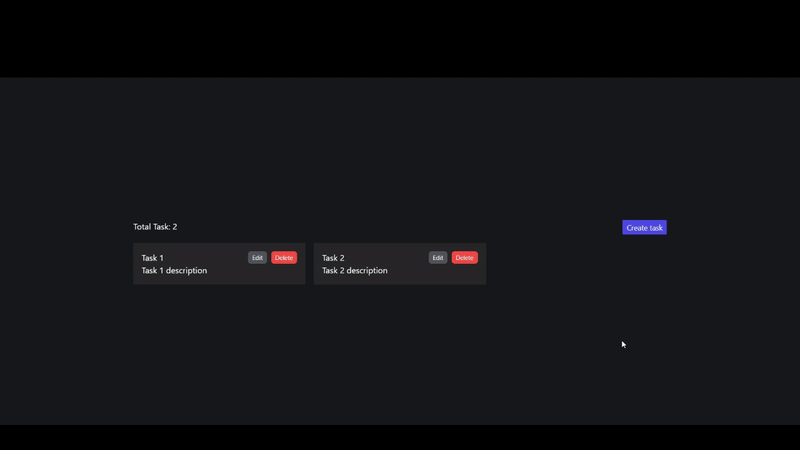

# TASK APP (React | Redux Toolkit | Tailwind CSS)

This is a small example of a web application ot manage (CRUD) Tasks.

## Demo



## Installation

```
git clone https://github.com/e-lua/react-rtk-crud
cd react-rtk-crud
npm i
npm start
```
